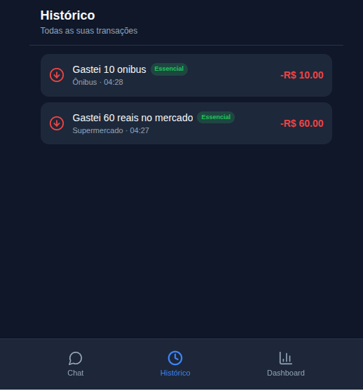
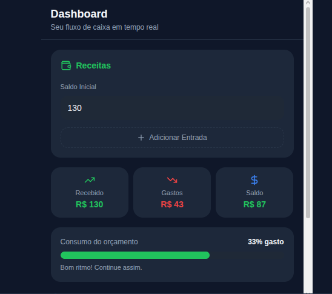
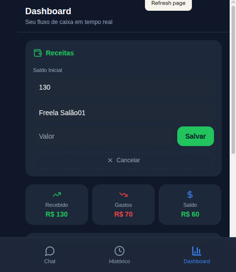
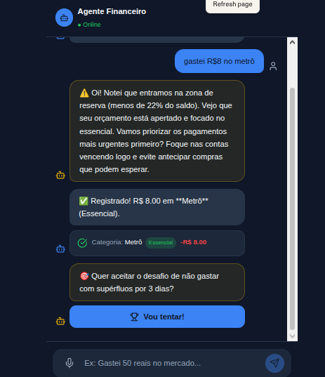

# MeuBolso: App de Organização de Finanças Pessoais com Vibe Coding MVP

O MeuBolso é um conceito de assistente financeiro pessoal que elimina a barreira da entrada de dados manual por meio de uma interface baseada em diálogo (Vibe Coding). O projeto foi desenvolvido focando na experiência de usuários que buscam simplicidade e, principalmente, para aqueles com fluxos de renda não convencionais.

**O Conceito**
Diferente de aplicativos financeiros tradicionais que utilizam formulários estáticos e planilhas complexas, o FlowFinance utiliza Agentes de IA para transformar mensagens de texto/áudio em registros financeiros organizados.

**>>🌟 Diferenciais & Personalizações**

O app foi adaptado para atender às dores reais de trabalhadores autônomos e freelancers:

**Gestão de Renda Variável:** O Dashboard permite múltiplas entradas de receita (diária, semanal ou mensal), calculando o saldo real em tempo real.

**Análise de Prioridades (Essencial vs. Supérfluo):** A inteligência do app não apenas soma valores, mas classifica os gastos.

Se o usuário gasta com algo Essencial (saúde, aluguel), a IA prioriza a segurança financeira.

Se o gasto é Supérfluo (lazer, mimos), a IA sugere cortes estratégicos quando o orçamento está apertado.

**Gatilho de Zona de Reserva:** Um alerta automático é ativado quando o saldo atinge 22% da receita total, mudando o tom da IA para um modo de consultoria proativa.

### Prompt Final (PRD para Lovable)
Este é o briefing estruturado utilizado para gerar o MVP funcional no Lovable:

**01.**
"Crie um MVP de aplicativo de finanças pessoais chamado 'MeuBolso' com foco em 'Vibe Coding' (minimalista e funcional). Use React, Tailwind CSS e Lucide React para ícones. A estrutura deve ser mobile-first com uma barra de navegação inferior contendo: 'Chat', 'Histórico' e 'Dashboard'. A tela inicial padrão deve ser a interface de Chat. Use uma paleta de cores moderna: fundo Dark Mode (Slate-900), com sotaques em azul maritimo e Branco."

**02.** 
"Agora, detalhe a tela de Chat. Adicione uma área de mensagens com balões de conversa elegantes. O input de texto na parte inferior deve ter um botão de 'Microfone' para simular entrada de áudio. Quando eu digitar algo como 'Gastei 50 reais no mercado', simule uma resposta do 'Agente Financeiro' confirmando a categoria e atualizando um pequeno card de feedback visual que aparece dentro do próprio chat."

"Agora, crie a tela de Dashboard focada em fluxo de caixa em tempo real. Ela deve conter:

Card de Receitas: Um campo para 'Saldo Inicial' e uma lista de 'Entradas Adicionais' (permitindo várias entradas manuais para quem recebe por dia/freela).

Resumo Financeiro: Exiba em destaque três valores: 'Total Recebido' (soma do inicial + entradas), 'Gastos até agora' (soma das despesas do chat) e o 'Saldo Restante' (calculado automaticamente).

Visualização: Use uma barra de progresso horizontal que diminui conforme os gastos aumentam em relação à receita total.

Dicas da IA: Mantenha a seção de cards horizontais com sugestões de economia baseadas no saldo que ainda resta para o mês.
Use um design limpo, com fontes legíveis e cores que facilitem a distinção entre entrada (verde) e saída (vermelho).

Quando um gasto for registrado com sucesso, exiba um breve feedback visual ( um ícone de check). Se o usuário adicionar uma Receita, mostre uma pequena animação de 'subida' no número do Saldo Total."

**04.**
(Versão Avançada de Lógica e Empatia)
"Implemente a lógica do 'Agente Financeiro' com foco em análise de prioridades e comportamento adaptativo:

Gatilho de Alerta (22%): Sempre que o 'Saldo Restante' for menor que 22% do 'Total Recebido', o Agente deve iniciar uma conversa com o tom: 'Oi! Notei que entramos na zona de reserva (menos de 22% do saldo). Vamos tentar segurar os gastos extras até o próximo recebimento?'.

Lógica de Sugestão (O Coração da IA):

Cenário A (Gastos Supérfluos Detectados): Se houver registros em categorias como 'Lazer' ou 'Mimos' no histórico recente, proponha uma micro-meta de economia realística (ex: 'Que tal evitarmos gastos em Lazer nos próximos 3 dias? Isso salvaria R$ X').

Cenário B (Sem Supérfluos / Renda no Fim): Se os gastos forem apenas essenciais (Aluguel, Comida, Luz), o Agente deve mudar a estratégia para Priorização: 'Vejo que seu orçamento está apertado e focado no essencial. Vamos priorizar os pagamentos mais urgentes primeiro? Foque em [Contas Vencendo Logo] e evite antecipar compras que podem esperar.'.

UI de Alerta: As mensagens desse alerta devem ter uma borda sutil amarela e um fundo levemente diferenciado para destacar a importância.

Gamificação e Feedback de Desafio:

Inclua o botão: 'Vou tentar'.

Ao clicar, crie um pequeno rastreador no Dashboard chamado 'Desafio de Economia'.

Sucesso: Se o usuário chegar ao fim do período definido sem estourar o limite, exiba no chat: 'Parabéns, você conseguiu! 🏆' com confetes visuais.

Falha: Se um novo gasto for registrado e estourar a meta, exiba com tom encorajador: 'Não foi dessa vez, mas na próxima eu consigo! Vamos reajustar?'."

**05.**
"Configure o sistema de categorias do MeuBolso. Crie uma lista interna onde:

Essenciais: 
Habitação: Aluguel, Condomínio, Luz, Água, Gás 
Alimentação Básica:EssencialSupermercado, Padaria, Feira
Saúde: Farmácia, Plano de Saúde, Dentista
Transporte: Combustível, Ônibus, Metrô, Manutenção
Educação: Mensalidade, Cursos, Livros didáticos

Supérfluos:
Lazer / Estilo de Vida: Cinema, iFood, Restaurante, Assinaturas (Netflix/Spotify)
Mimos / Desejos: Roupas novas, Eletrônicos, Viagens, Hobbies

Outros:Neutro Gastos inesperados (precisam de análise da IA)

Quando o usuário registrar um gasto via chat, a IA deve automaticamente atribuir uma dessas categorias. Se a IA estiver em dúvida, ela deve perguntar: 'Isso é essencial ou um mimo para você?'.
No Dashboard, exiba um pequeno indicador (badge) ao lado de cada transação no histórico mostrando se ela foi 'Essencial' ou 'Supérfluo', ajudando o usuário a ter consciência visual imediata de onde o dinheiro está indo."

**06**

"Preciso de dois ajustes urgentes no MeuBolso:

Correção de Categorias: Force o sistema a classificar 'Lanchonete', 'Restaurante', 'iFood' e 'Lanche' como Supérfluo (Categoria: Lazer/Alimentação Extra), e não como Essencial/Gás. Crie um dicionário de palavras-chave para garantir que gastos com alimentação fora de casa nunca sejam confundidos com contas fixas de casa (como Gás ou Luz).

Funcionalidade de Edição (CRUD): >    - No 'Histórico de Gastos', adicione um ícone de Lixeira para excluir uma transação e um ícone de Lápis para editar o valor ou a categoria caso o usuário erre a digitação.

No Chat, permita que eu diga 'apague o último' ou 'corrija o valor para R$ X' e a IA deve atualizar o registro mais recente automaticamente."

===FIM===

=========

#### Resumo:
Interface: Mobile-first, Dark Mode, com navegação inferior (Chat, Histórico, Dashboard). A tela principal é o Chat.

Dashboard de Renda Variável: Deve permitir a entrada de um Saldo Inicial e múltiplas 'Receitas Adicionais' (diárias/semanais). Exiba em destaque: 'Total Recebido', 'Gastos até agora' e 'Saldo Restante'.

Inteligência do Agente: Implemente lógica onde a IA classifica gastos em 'Essencial' ou 'Supérfluo'.

Lógica de Alerta (22%): Se o 'Saldo Restante' cair abaixo de 22% do 'Total Recebido', o Agente deve iniciar uma conversa de alerta amarelo no chat. Se houver gastos supérfluos, sugira metas de economia. Se não houver, sugira priorização de contas urgentes.

Interatividade: Adicione o botão 'Vou tentar' no chat. Se o usuário cumprir a meta, mostre 'Parabéns você conseguiu!'. Se falhar, mostre 'Na próxima eu consigo'.

Estética: Use animações suaves (Framer Motion) e um design minimalista e elegante."

#### >> Aprendizados
O desenvolvimento deste conceito através do Vibe Coding trouxe insights valiosos sobre desenvolvimento de sistemas:

Intenção sobre Sintaxe: Como estudante de ADS, percebi que saber o que pedir e como estruturar o problema (através de um PRD claro) é tão importante quanto escrever o código manualmente. A IA atua como um acelerador de produtividade, permitindo focar na arquitetura e na experiência do usuário e economizar tokens.

O Valor da Maturidade na Lógica: Minha experiência prévia com sistemas (Linux) ajudou a definir fluxos de dados mais lógicos, como a regra de gatilho de 22% e a diferenciação entre tipos de gastos. A tecnologia muda, mas a lógica de resolução de problemas é universal.

Humanização de Dados: Transformar um JSON frio em uma conversa empática é o segredo para a retenção de usuários. O MeuBolso prova que um sistema pode ser tecnicamente robusto e, ao mesmo tempo, acolhedor.

#### Como testar?
Copie o Prompt Final acima.

Cole no Lovable.dev.

Interaja com o chat simulando gastos diários e veja o Dashboard e o Agente reagirem em tempo real.

Luciana Jorge de Faria

